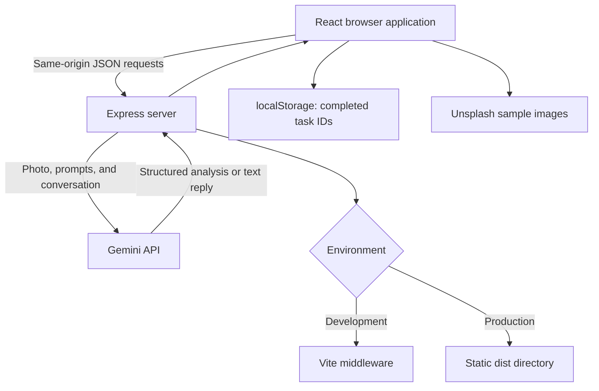

# DeclutterAI

An AI-assisted room organization app that turns a room photo into a practical decluttering plan, then helps you work through it with task tracking, organizing advice, item triage, and timed sprints.

The frontend is a React single-page application. An Express server handles Gemini requests and serves the frontend through Vite in development or from `dist/` in production. The Gemini API key stays on the server.

> **Current status:** The core workflows are implemented, but this repository should be treated as a prototype rather than a hardened public service. See [Known limitations and review findings](#known-limitations-and-review-findings) before deploying. The configured Gemini model identifiers are documented from source; their availability and account eligibility have not been verified through live requests.

## Contents

- [Features](#features)
- [Technology stack](#technology-stack)
- [Getting started](#getting-started)
- [Configuration](#configuration)
- [Using the app](#using-the-app)
- [Sample rooms and fallback behavior](#sample-rooms-and-fallback-behavior)
- [Architecture and project structure](#architecture-and-project-structure)
- [API reference](#api-reference)
- [Data, privacy, and persistence](#data-privacy-and-persistence)
- [Scripts and production deployment](#scripts-and-production-deployment)
- [Raspberry Pi and Tailscale deployment](#raspberry-pi-and-tailscale-deployment)
- [Validation and testing](#validation-and-testing)
- [Troubleshooting](#troubleshooting)
- [Known limitations and review findings](#known-limitations-and-review-findings)
- [Contributing and license](#contributing-and-license)

## Features

### Photo-based room analysis

- Upload a photo using the file picker or drag-and-drop.
- Capture a photo using the device camera, subject to browser permissions.
- Choose a sample room image.
- Set the room type, organizing priority/style, and desired outcome.
- Generate a structured analysis containing:
  - Room identification and a visual summary.
  - A clutter score from 1 to 100, with higher values indicating more clutter.
  - A calmness rating and estimated organizing time.
  - Clutter hotspots, approximate image locations, identified items, and quick fixes.
  - Sequential decluttering phases with actionable tasks, tips, and time estimates.
  - A keep / donate or sell / recycle or trash / relocate matrix.
  - Storage recommendations and budget-friendly DIY alternatives.
  - A short daily maintenance routine and an optional motivational summary.

### Working through the plan

- Check off tasks and see completion progress.
- Browse plan, hotspot, triage, storage, and habit views.
- Copy a text version of the summary, task plan, and maintenance habit to the clipboard. This is not a complete export of all analysis sections, and exported tasks currently appear unchecked regardless of their completion state.

### AI assistants and productivity tools

| Assistant/tool | Purpose | Model configured in source |
| --- | --- | --- |
| Space Architect | Spatial layout, zoning, furniture, and storage advice | `gemini-3.5-flash` |
| Mindful Declutter Coach | Encouraging guidance, sentimental-item decisions, and habits | `gemini-3.5-flash` |
| Sprint Triage assistant | Fast, concise organizing advice | `gemini-3.1-flash-lite` |
| Quick item triage | A keep/donate/recycle/relocate recommendation for an item | `gemini-3.1-flash-lite` |
| Sprint timer | Start, pause, and reset 5-, 10-, 15-, or 25-minute sessions | No AI request |

Room analysis uses `gemini-3.5-flash`. Some existing UI text and comments mention Gemini 3.1 Pro or automatic model fallback; those labels do not match the implemented backend behavior. No automatic retry with a different model is implemented.

AI scores, locations, estimates, and recommendations are approximate advice, not measurements or professional safety assessments. Review disposal and furniture-placement suggestions before acting on them.

## Technology stack

Versions below reflect the ranges declared in `package.json`, not a verified installed dependency tree.

| Area | Libraries/tools |
| --- | --- |
| Frontend | React 19, React DOM, TypeScript |
| Styling | Tailwind CSS 4 through `@tailwindcss/vite` |
| UI | Lucide React icons and Motion animations |
| Frontend tooling | Vite 8 and `@vitejs/plugin-react` |
| Backend | Express 4, dotenv |
| AI | Google's `@google/genai` SDK |
| Development runtime | `tsx` |
| Local persistence | Browser `localStorage` for completed task IDs |

There is no database, user-account system, or authentication layer in the current implementation.

## Getting started

### Prerequisites

- **Node.js:** A current Node 22 LTS release at or above 22.12 is a practical baseline for Vite 8. Vite also supports the Node 20 line from 20.19; check your resolved packages' engine requirements when installing.
- **npm:** Used by the commands below.
- **Gemini API key:** Create one through [Google AI Studio](https://aistudio.google.com/apikey) and verify access to the models configured in `server.ts`.
- **Browser:** A modern browser with file-upload support. Camera and clipboard features generally require localhost or an HTTPS secure context.
- **Internet access:** Required for Gemini features and remote sample images.

### 1. Install dependencies

From the repository root:

```sh
npm install
```

A `package-lock.json` is included to record the resolved dependency tree. Use `npm ci` for a clean, reproducible installation, or `npm install` when intentionally updating dependencies. Vite 8.3 requires esbuild `^0.27.0 || ^0.28.0`; this project declares `^0.28.0` to satisfy that peer dependency. Do not use `--force` or `--legacy-peer-deps` to mask dependency conflicts.

### 2. Configure the environment

Create a `.env` file in the repository root:

```dotenv
GEMINI_API_KEY=your_gemini_api_key_here
PORT=3000
NODE_ENV=development
```

Replace the example key with your own. `.env` files are ignored by Git. Do not put this credential into frontend source or a `VITE_`-prefixed environment variable, which can expose values to the browser bundle.

### 3. Start the application

```sh
npm run dev
```

Open **http://localhost:3000**, or the port configured in `PORT`.

This command starts Express and attaches Vite in middleware mode. Use this integrated server, rather than starting Vite alone, so the same-origin `/api/*` routes are available.

### 4. Check the backend

```sh
curl http://localhost:3000/api/health
```

The response should include `status`, `hasApiKey`, and `timestamp`. `hasApiKey: true` means an environment value is present; it does **not** establish that the credential works or that the configured models are available. A missing key may also prevent SDK initialization before the server becomes reachable.

## Configuration

| Variable | Default | Purpose |
| --- | --- | --- |
| `GEMINI_API_KEY` | None | Server-side Gemini credential required for AI functionality. |
| `PORT` | `3000` | Port used by Express. |
| `HOST` | `127.0.0.1` | Listening address. Loopback is suitable for Tailscale Serve; use `0.0.0.0` only when intentionally allowing direct IPv4 LAN access. |
| `NODE_ENV` | Development behavior unless exactly `production` | Selects Vite middleware or static serving from `dist/`. |
| `DISABLE_HMR` | HMR enabled unless exactly `true` | Disables Vite hot-module replacement and file watching when set to `true`. |

Model names are hardcoded, not environment-configurable. To change them, review `server.ts`, the role mapping in `src/components/DeclutterChatbot.tsx`, and the model types in `src/types/index.ts`. Keep user-facing labels consistent with the actual requests.

The server defaults to loopback (`127.0.0.1`), so direct connections from other machines are disabled. Setting `HOST=0.0.0.0` exposes it on all IPv4 interfaces, subject to firewall rules. This includes unauthenticated AI endpoints; do not expose a development instance with a paid API key to an untrusted network.

## Using the app

1. **Choose an image.** Upload a photo, take a camera snapshot, or select a sample card.
2. **Describe your objective.** Pick the room type and priority, then enter a goal.
3. **Analyze the room.** The browser submits the image as base64 to the backend, which requests a structured Gemini response.
4. **Explore the result.** Review the summary, hotspots, phased plan, item categories, storage suggestions, and maintenance habit.
5. **Make progress.** Check off tasks or start an organizing sprint.
6. **Ask for help.** Open the chatbot, choose a role, and ask a follow-up question. The current photo and a brief room summary accompany chat requests.
7. **Triage a specific item.** Enter its description, when it was last used, and emotional attachment.
8. **Scan another room.** New Scan clears the current photo and analysis, but currently does not reset chat history or completed task IDs. Clear chat separately when switching room contexts, after any pending response finishes.

For more reliable uploads, use a reasonably sized JPEG, PNG, or WebP. The interface mentions a 20 MB image limit, but the client does not enforce that limit or resize uploads. The server's JSON body limit is **25 MB**, and base64 encoding adds approximately one-third to the original file size before JSON overhead. A 20 MB photo can therefore exceed the request limit.

## Sample rooms and fallback behavior

Four sample cards are defined in `src/data/sampleRooms.ts`:

- Work Desk & Cable Tangle
- Living Room & Coffee Table
- Overflowing Wardrobe & Closet
- Disorganized Kitchen Counter

The images are loaded from `images.unsplash.com`. Selecting a sample sets its preview and room type; you must still click Analyze to request an analysis.

**Samples are not an offline mode.** Their images must be downloaded, and the app attempts a normal backend analysis first. Only the `home-office-desk` sample has a bundled fallback result. It is used when the subsequent analysis request fails. It is a fixed example, not a newly generated result, and does not adapt to changes in the goal or style.

If the image download itself fails, the current uploader does not reach that fallback. The remaining three samples have no bundled fallback analysis. Preview scores and descriptions are static sample metadata, not computed findings.

## Architecture and project structure



```text
.
├── index.html                      # Browser HTML entry
├── metadata.json                   # App metadata / hosting capability declaration
├── package.json                    # Scripts and dependency ranges
├── server.ts                       # Express routes, Gemini prompts/schema, frontend serving
├── tsconfig.json                   # Shared TypeScript configuration
├── vite.config.ts                  # React/Tailwind plugins, alias, and HMR settings
└── src/
    ├── main.tsx                    # React entry point
    ├── App.tsx                     # Analysis lifecycle, task persistence, modal coordination
    ├── index.css                   # Tailwind import
    ├── components/
    │   ├── Navbar.tsx              # Navigation and progress display
    │   ├── RoomUploader.tsx        # Upload, camera, samples, and analysis preferences
    │   ├── RoomAnalysisView.tsx    # Results, tasks, hotspot overlay, and text-plan copy
    │   ├── DeclutterChatbot.tsx     # Conversation UI and assistant role selection
    │   ├── QuickTriageModal.tsx     # Item decision form
    │   └── SprintTimerModal.tsx     # Timed organizing sessions
    ├── data/sampleRooms.ts         # Sample images and one fallback analysis
    ├── types/index.ts              # Room, task, hotspot, and chat types
    └── utils/imageUtils.ts         # File/remote image conversion to base64
```

The backend holds no conversation session: the frontend sends the conversation on each request. The analysis endpoint asks Gemini for JSON using a response schema, then parses the returned text. There is no independent runtime validation of the parsed result before it reaches the UI.

## API reference

All routes are implemented in `server.ts`. Request and response bodies are JSON. The current API has no authentication or application-level rate limiting; these examples are for local development, not an endorsement of unauthenticated public deployment.

### `GET /api/health`

Returns configuration presence and a timestamp:

```json
{
  "status": "ok",
  "hasApiKey": true,
  "timestamp": "2026-10-06T12:00:00.000Z"
}
```

This endpoint does not make a Gemini request.

### `POST /api/analyze-room`

Request shape:

```json
{
  "imageBase64": "<base64-encoded-image-bytes>",
  "mimeType": "image/jpeg",
  "roomType": "Home Office",
  "priority": "Balanced, functional and calming",
  "goal": "Clear the desk and create an easy daily reset"
}
```

- `imageBase64` is required. An image data URI prefix is stripped if present.
- `mimeType` defaults to `image/jpeg`.
- Omitted room preferences receive defaults in the prompt.

Successful response:

```text
{
  result: RoomAnalysisResult,
  modelUsed: "gemini-3.5-flash"
}
```

`RoomAnalysisResult` is defined in `src/types/index.ts`. It contains `roomType`, `roomSummary`, `clutterScore`, `calmnessRating`, `estimatedTimeMinutes`, `hotspots`, `declutterPhases`, `triageMatrix`, `recommendedStorageSolutions`, `dailyMaintenanceHabit`, and optional `motivationalSummary`.

Hotspots may include `{ x, y }` coordinates expressed as percentages of the image. Tasks contain IDs, actions, tips, and estimated minutes. The response schema does not enforce every frontend constraint, such as the severity union or numeric ranges.

### `POST /api/chat`

Example without an image:

```json
{
  "messages": [
    { "role": "user", "content": "What should I organize first?" }
  ],
  "role": "coach",
  "roomContext": {
    "roomType": "Home Office",
    "clutterScore": 78,
    "roomSummary": "Paperwork and cables crowd the desk."
  }
}
```

- `messages` must be a nonempty array. Each message is expected to have `role` and `content`.
- Supported UI roles are `architect`, `coach`, and `sprint`; the default is `coach`.
- Optional `model` overrides the role-based backend model selection. The server currently does not enforce an allowlist.
- Optional `imageBase64` and `mimeType` attach a photo to the first user turn; MIME type defaults to `image/jpeg`.
- Optional `roomContext` supplies a brief summary, not the full action plan.

Successful response:

```json
{
  "reply": "Start by clearing a small working area on the desk.",
  "modelUsed": "gemini-3.5-flash",
  "roleUsed": "coach"
}
```

### `POST /api/quick-triage`

```json
{
  "itemDescription": "An unused desk organizer",
  "itemAge": "3 years",
  "frequencyOfUse": "Not used in the last year",
  "emotionalAttachment": "Low"
}
```

`itemAge` is supported by the backend even though the current UI does not collect it. The response is an unstructured text verdict, not an enum or structured decision object:

```json
{
  "verdict": "DONATE — It no longer serves your routine. Place it in your donation box."
}
```

### Errors and limits

- Missing analysis image or empty/invalid chat message array: `400` with an `error` field.
- Exceptions, including provider errors: generally `500` with an `error` field. Analysis/chat also include raw `details`.
- Invalid JSON or an oversized request is handled by Express body parsing, before the route handlers; do not assume every error response is JSON.
- There is no application-level quota retry, alternate-model fallback, streaming response, or request cancellation.

## Data, privacy, and persistence

### What leaves the browser

- Analysis sends the selected photo and preferences to the application server and then to Gemini.
- Chat resends the current image, the full conversation, and a brief room context on every request. This can increase payload size, latency, and API usage.
- Quick triage sends the item description and supplied context to Gemini.
- Uploaded files are base64-encoded without re-encoding or metadata stripping. Embedded EXIF information may therefore remain in the submitted file.
- Sample thumbnails and downloads contact Unsplash, including on the initial sample-selection screen.

Do not upload sensitive photos or personal information without considering the AI provider's current data policies. Server hosting, infrastructure logs, and Google's processing/retention policies are outside what this source review can establish. Provider errors are logged by the backend; review production logging and error redaction before handling sensitive data.

### What is stored locally

| Data | Current behavior |
| --- | --- |
| Completed task IDs | Persisted in `localStorage` under `declutter_completed_tasks`; not scoped to a room or analysis. |
| Photo and active analysis | React memory only; lost on reload. |
| Chat history | React memory only; closing chat or starting a new scan does not reset it. |
| Triage form/result | In-memory component state; closing the modal does not reset it. |
| Sprint timer | In-memory component state; continues while the modal is closed. |

The application code has no database or explicit image-file persistence. That is not a guarantee that a hosting platform or AI provider retains no data.

To clear persisted task completion in this browser, remove the `declutter_completed_tasks` key through browser developer tools or clear site storage. This does not remove any data already submitted to the provider.

## Scripts and production deployment

| Command | What it does |
| --- | --- |
| `npm run dev` | Runs `tsx server.ts`; defaults to Express + Vite development mode. |
| `npm run build` | Builds the frontend into `dist/`; does not compile the backend. |
| `npm run preview` | Runs Vite's local frontend build preview; does not start the Express API. |
| `npm start` | Runs `node server.ts`; requires compatible native TypeScript execution and runtime import behavior. This path has not been validated. |
| `npm run lint` | Runs `tsc --noEmit`; this is a type check, not an ESLint/style-lint task. |
| `npm run clean` | Deletes `dist/` and `server.js`; uses the Unix `rm` command. |

### Production serving

The frontend and API need an active Node server. Deploying `dist/` alone does not provide Gemini endpoints.

A straightforward path using the existing TypeScript runner is:

```sh
npm install
npm run build
NODE_ENV=production npx tsx server.ts
```

These are POSIX-shell commands. Supply `GEMINI_API_KEY` and optionally `PORT` through your hosting environment, and ensure the process runs from the repository root. With `NODE_ENV=production`, Express serves `dist/` and its SPA fallback instead of creating a Vite development server.

`tsx` is currently a **development dependency**, so this launch path requires it to be installed. An installation using `--omit=dev` will not provide it. A production pipeline should deliberately choose either an installed TypeScript runner or a separately compiled backend. The existing build script generates no `server.js`.

Do not assume `npm start` works merely because Node can run some TypeScript files: `server.ts` also imports Express types using ordinary named imports rather than explicit type-only imports. Verify the chosen runtime or build pipeline. The commands above are documented from the implementation, not a successfully tested deployment.

Vite's [`preview` command](https://vite.dev/guide/cli.html#vite-preview) is a local build preview, not a production server. This repository does not configure a preview proxy for `/api`, so use Express to test end-to-end features.

Before public deployment, add access controls, rate/cost limits, request validation, safe error handling, HTTPS, and appropriate upload limits. The present API allows callers to consume the server's Gemini credential without signing in.

## Raspberry Pi and Tailscale deployment

See the [Raspberry Pi deployment guide](docs/raspberry-pi-deployment.md) for 64-bit OS prerequisites, installation, a persistent systemd service, private HTTPS through Tailscale Serve, updates, and troubleshooting. A ready-to-customize unit is provided in [`deploy/declutter-ai.service`](deploy/declutter-ai.service).

The recommended setup binds Express to `127.0.0.1:3000` and proxies the entire app through Tailscale Serve. Serve restricts access to authorized tailnet devices; it does not grant access to every device on your LAN. No Pi/ARM deployment has been tested locally.

## Validation and testing

No automated test suite or `test` script is present in the reviewed repository.

Basic project checks:

```sh
npm run lint
npm run build
```

### Review-time validation

- Source review covered the backend, frontend components, image utilities, types, sample data, and configuration.
- The initial review could not run checks because dependencies were missing. A follow-up installation resolved the Vite/esbuild peer conflict by updating the direct esbuild dependency from `^0.25.0` to `^0.28.0` and generated `package-lock.json`.
- npm reported 180 packages added; `npm ls vite esbuild tsx` confirmed Vite `8.3.3` and tsx `4.23.15` share esbuild `0.28.2` without a peer conflict.
- `npm run lint` completed with no TypeScript errors.
- `npm run build` completed successfully and generated `dist/`.
- The editor terminal wrapper reported a separate `Cannot set tty process group` error after the commands completed; the installation and build output above were observed despite that wrapper error.
- npm warned that install scripts for `@google/genai`, `esbuild`, and `protobufjs` were not covered by its `allowScripts` policy. The frontend build succeeded; review script approval if a runtime operation requires one of those scripts.
- Local production startup was smoke-tested with a dummy key using the service's Node/tsx launch method: default loopback and explicit `HOST=0.0.0.0` both bound to the expected address, returned health JSON, and served the built frontend. No Gemini requests were made.
- `systemd-analyze verify deploy/declutter-ai.service` returned exit code 0. This validates the unit syntax, not its operation on the Pi.
- Browser workflows, camera behavior, live Gemini requests, Pi/ARM execution, and Tailscale connectivity have not been tested. These checks are not end-to-end validation.

### Suggested manual smoke test

After installing dependencies and configuring a working key:

1. Start the integrated server and check `/api/health`.
2. Analyze a small JPEG; confirm all result sections render.
3. Analyze a PNG/WebP and ask a follow-up chat question, checking MIME handling.
4. Mark a task complete, reload, and check the documented persistence behavior.
5. Scan another room and inspect task completion and chat context for cross-room leakage.
6. Exercise all three chat roles and quick triage.
7. Test the timer's start, pause, reset, and closed-modal behavior.
8. Allow, deny, and cancel camera access; ensure capture ends on cancellation and unmount.
9. Test each sample, including failed image downloads and failed analysis requests.
10. Test clipboard denial, keyboard-only navigation, modal focus, and large-file rejection.
11. Build the frontend and repeat API checks with Express in production mode.

## Troubleshooting

| Symptom | What to check |
| --- | --- |
| `vite` or `tsc` is not found | Run `npm install` and confirm development dependencies are installed. |
| npm reports an unavailable package version | Verify the declared version ranges against the registry; use the included lockfile with `npm ci` for reproducible installs. |
| Missing-key startup error or AI request failure | Set `GEMINI_API_KEY` on the server and restart; check account access and provider error output. |
| Unknown model / quota / billing error | Verify the hardcoded model IDs and your account's current limits. The UI's automatic-fallback wording is not backed by a retry implementation. |
| UI loads but `/api/*` requests fail | Use `npm run dev` or the Express production process, not Vite preview or static-only hosting. |
| Camera is unavailable | Use localhost or HTTPS, grant permission, and check iframe/hosting permissions. `metadata.json` currently requests no frame permissions. Upload a file as an alternative. |
| Large photo fails to analyze | Reduce its size. Base64 expansion can exceed Express's 25 MB JSON limit even when the original photo is under the advertised client limit. |
| A sample image fails before analysis | Check connectivity and CORS to Unsplash; image-preparation failures currently bypass the sample fallback. |
| Tasks appear completed in a new plan | Completion IDs are shared across analyses. Clear the local storage key or uncheck tasks; room-scoped persistence is not implemented. |
| Production returns missing `index.html` | Run `npm run build` and keep `dist/` alongside `server.ts`. |
| Clipboard copy fails | Use a secure context and check browser permissions; the current UI can show “Copied!” before confirming success. |

## Known limitations and review findings

These are source-based findings, not results of an executed browser test. Priority reflects what should be addressed before a public launch. References point to the relevant implementation.

| Priority | Finding | Evidence / recommended direction |
| --- | --- | --- |
| High | Unauthenticated AI endpoints permit uncontrolled use of the server's API key. | `server.ts` exposes all three AI routes without authentication, rate limiting, or usage budgets; chat also accepts arbitrary model overrides. Add access control, per-user limits, and a model allowlist. |
| High | Camera tracks can remain active after cancellation or uploader unmount. | `RoomUploader.tsx` sets active state before awaiting `getUserMedia`, accepts a late stream after cancellation, and has no unmount cleanup. Stop obsolete streams and clean up all tracks when leaving the uploader. |
| Medium | Chat attaches non-JPEG photos with a default JPEG MIME type. | `App.tsx` stores image bytes but not the active MIME type; `DeclutterChatbot.tsx` sends the bytes without `mimeType`, while `server.ts` defaults to `image/jpeg`. Preserve and forward the original MIME type. |
| Medium | Room changes and chat resets do not isolate request state. | New Scan leaves chat history intact; an in-flight chat request can restore history after Clear Chat. Namespace conversations by scan and abort/invalidate stale responses. |
| Medium | Completed task IDs leak across plans. | `App.tsx` uses one global local-storage set and does not clear it on New Scan. Scope completion to a persisted analysis/session or reset it for a new plan. |
| Medium | Input and AI output validation are incomplete. | `server.ts` checks only a few required fields and parses model JSON without independent shape validation; the frontend assumes arrays exist. Validate types, supported images/models/roles, numeric ranges, and the complete result structure before rendering. |
| Medium | Image preparation errors and overlapping analyses are not handled reliably. | `RoomUploader.tsx` awaits file/sample conversion outside App's error handler and is not locked during that preparation; `imageUtils.ts` does not check HTTP status/content type. Handle preparation errors, reject invalid images, and prevent stale requests from updating state. |
| Medium | Upload size guidance conflicts with actual request limits. | The client accepts any `image/*` file without a size check or resize; Express accepts 25 MB JSON, not 25 MB original files. Enforce consistent limits and consider re-encoding/resizing with metadata removal. |
| Medium | Dialogs and controls need accessibility work. | Triage/timer overlays lack dialog semantics and focus management; form labels are not linked to controls; task buttons lack accessible names/state. Add accessible dialogs, associated labels, native checkboxes, and live status announcements. |
| Medium | Raw provider errors are returned to clients. | Analysis/chat responses include exception messages and `details`. Return safe public errors and retain redacted operational details server-side. |
| Medium | Image pins are not reliable spatial measurements. | `RoomAnalysisView.tsx` overlays percentages on an `object-cover` image, which can crop it, and invents fallback positions when coordinates are absent. Preserve the source coordinate space and distinguish unlocalized hotspots. |
| Low | Success/model messaging is misleading in some paths. | Clipboard success is shown before awaiting permission; UI model labels and quota-fallback messages diverge from backend behavior. Await successful copy and align labels with actual requests. |

### Recommended implementation order

1. Secure the AI endpoints and enforce request/response schemas and upload limits.
2. Fix camera lifecycle cleanup and preserve image MIME type through chat.
3. Make requests cancellable/stale-safe and scope chat/task state to an analysis.
4. Improve accessibility, sample error handling, and accurate model/status messaging.
5. Keep the dependency lockfile current and validate the production server runtime.
6. Add automated tests for validation, state boundaries, failure handling, and critical user flows.

## Contributing and license

Keep the backend schema in `server.ts`, frontend types in `src/types/index.ts`, sample presets, and result UI aligned when adding fields. Keep the chat role/model mapping synchronized between client and server. Never commit API keys or sensitive room photos.

Before submitting a change, run the type check and frontend build, then manually exercise the affected workflows. Changes involving state resets, camera access, or remote requests should include regression tests when test infrastructure is introduced.

No `LICENSE` file was present at review time. Do not assume an open-source license grants reuse rights until the repository owner adds an explicit license.
